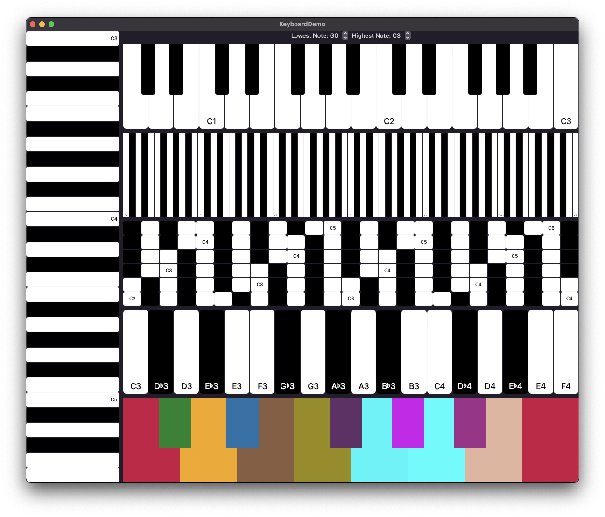

# Keyboard

Keyboard aims to be an easy-to-use musical keyboard with:

- multi-touch interface
- accurate note name labels on the piano keys given the musical key
- stylized keys in any color
- any number of notes, not just limited to octaves

## Goals

- Good user interface
- Good performance. We rely on SwiftUI's drag gestures

## Install

Install using Swift Package Manager.
